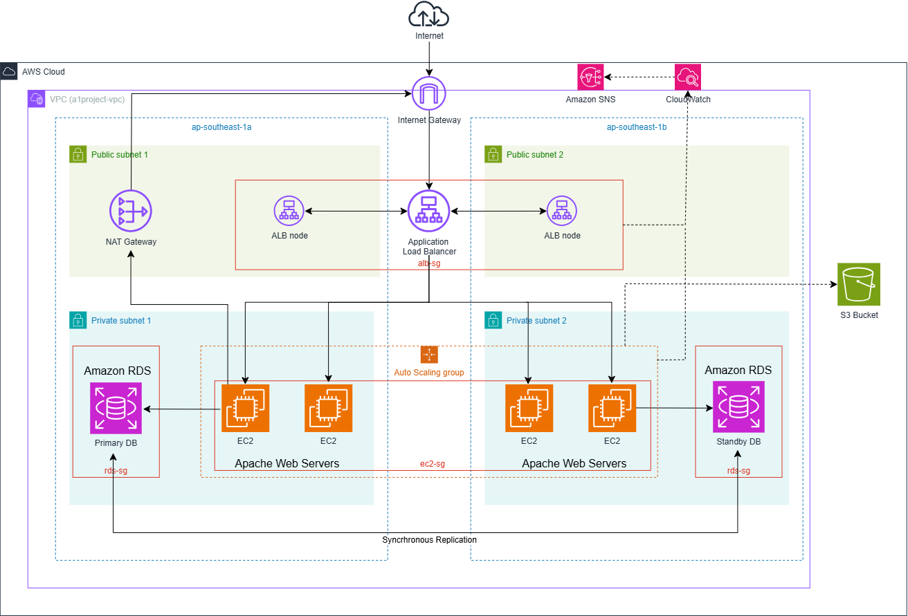

# PROJECT 2: Highly Available AWS Web Architecture — Terraform Edition

A Terraform reimplementation of [Project 1: Highly Available, Fault-Tolerant AWS Web Architecture](https://github.com/Knirl/aws-ha-fault-tolerant-architecture.git) — same infrastructure, same design goals, this time provisioned entirely as code instead of built manually through the AWS Console.

**Project 1 summary, for context:** a VPC spanning 2 Availability Zones, an Application Load Balancer distributing traffic to an Auto Scaling Group of EC2 instances (private subnets), a self-healing Multi-AZ RDS MySQL database, an S3 bucket, and CloudWatch dashboards/alarms wired to SNS — built and manually verified to survive instance failure, security group misconfiguration, and AZ-level database failover. Full architecture rationale, the "why these services" comparisons, and the original testing/troubleshooting log live in that repo's README — this document focuses on what changed by rebuilding it in Terraform.

## Table of Contents

- [Architecture](#architecture)
- [What Changed, Building This in Terraform](#what-changed-building-this-in-terraform)
- [Prerequisites](#prerequisites)
- [Project Structure](#project-structure)
- [Build & Deploy](#build--deploy)
- [Verification & Testing](#verification--testing)
- [New Challenges Specific to the IaC Rebuild](#new-challenges-specific-to-the-iac-rebuild)
- [Cost Considerations](#cost-considerations)
- [Teardown](#teardown)
- [Roadmap: v2](#roadmap-v2)

---

## Architecture

Unchanged from Project 1:

```

```

Security model, also unchanged: `Internet → alb-sg (0.0.0.0/0:80) → ec2-sg (from alb-sg only:80) → rds-sg (from ec2-sg only:3306)`.

## What Changed, Building This in Terraform

The architecture is identical. What building it as code actually forced me to confront:

**The Console hides real complexity.** Project 1's networking layer was created via the "VPC and more" wizard in a single guided flow. Terraform has no equivalent shortcut — the VPC, 4 subnets, Internet Gateway, NAT Gateway, Elastic IP, 2 route tables, and their associations all had to be declared as 10+ individual resources. Rebuilding it this way is what made it clear exactly what that wizard was doing on my behalf the first time.

**Dependency ordering becomes explicit, not assumed.** In the Console, click order enforces itself implicitly (you can't attach a route table to a subnet that doesn't exist yet). In Terraform, resource references (e.g. a security group rule pointing at another security group's ID) are what build the dependency graph — and where no such reference exists but an order is still required (e.g. NAT Gateway needing the Internet Gateway attached first), `depends_on` has to be added deliberately.

**Secrets management became a real design decision.** The Console build never surfaced *how* the RDS password was being stored. Writing it in Terraform meant explicitly deciding: generate it randomly (`random_password`), store it in Secrets Manager, and feed it into the RDS resource by reference — so the credential never appears as plaintext anywhere in the codebase.

**State introduced a new operational layer that doesn't exist in a console build.** Terraform needed a place to track what it created. This meant a one-time bootstrap step (a separate mini-project creating an S3 bucket) before the real infrastructure could even be initialized — solving the chicken-and-egg problem of needing infrastructure to store the state that describes infrastructure.

**Reproducibility, concretely demonstrated.** The entire environment — NAT Gateway, ALB, RDS Multi-AZ, everything — was torn down and rebuilt from scratch multiple times during development by running `terraform apply`, something that would mean manually repeating dozens of console steps identically each time.

## Prerequisites

- An AWS account (this project uses paid resources — see [Cost Considerations](#cost-considerations))
- [Terraform CLI](https://developer.hashicorp.com/terraform/downloads) installed locally
- AWS CLI configured with an IAM user's programmatic access keys (not the root account)
- An AWS budget alert configured (recommended, not required) to catch unexpected spend

## Project Structure

```
.
├── state-bootstrap/          # One-time setup: creates the S3 bucket that holds
│   └── main.tf                # this project's remote state. Run once, then left alone.
│
└── project2/                  # The actual infrastructure
    ├── main.tf                 # terraform + backend + provider blocks
    ├── vpc.tf                   # VPC and 4 subnets across 2 AZs
    ├── networking.tf            # Internet Gateway, NAT Gateway, route tables
    ├── security-groups.tf       # Chained alb-sg → ec2-sg → rds-sg
    ├── rds.tf                   # DB subnet group, Secrets Manager password, RDS instance
    ├── ec2.tf                   # AMI lookup, Launch Template, Auto Scaling Group + policy
    ├── alb.tf                   # Target Group, Load Balancer, Listener
    ├── s3.tf                    # Private, versioned, encrypted static assets bucket
    ├── cloudwatch.tf             # Dashboard, alarm, SNS topic + subscription
    └── .gitignore                # Excludes state files, .tfvars, and .terraform/
```

## Build & Deploy

```bash
# One-time: bootstrap the remote state bucket
cd state-bootstrap
terraform init
terraform apply

# Deploy the actual architecture
cd ../project2
terraform init
terraform plan
terraform apply
```

Terraform resolves the correct creation order automatically from resource references — networking, then security groups, then RDS/EC2/ALB, then CloudWatch — with no manual sequencing required. Full resource-by-resource detail is in the `.tf` files themselves, each named by concern (see [Project Structure](#project-structure)).

## Verification & Testing

Same manual verification process as Project 1 — Terraform provisions infrastructure, it doesn't test runtime behavior, so testing still happens via the AWS Console and browser after `apply` completes: load balancing (Instance ID alternating on refresh), auto-healing (security group removed → Target Group unhealthy → alarm → SNS email → ASG replacement attempts → recovery on restoring the rule), and RDS failover (`Reboot with failover`, confirmed by the AZ change). See Project 1's README for the full walkthrough and results — behavior was identical here.

## New Challenges Specific to the IaC Rebuild

Issues that only came up because this was built in Terraform (see Project 1's README for the original Console-build issues, which don't repeat here):

Deprecated `dynamodb_table` backend parameter**
Terraform flagged `dynamodb_table` as deprecated in favor of `use_lockfile = true`, which uses S3's native conditional-write locking instead of a separate DynamoDB table. Migrated with `terraform init -reconfigure`, since only the locking mechanism changed, not the state's actual location.


## Cost Considerations

| Resource | Free tier eligible? | Notes |
|---|---|---|
| EC2 t2/t3.micro | Yes (750 hrs/mo, 12 months) | |
| RDS db.t3.micro, single-AZ | Yes | |
| **RDS Multi-AZ** | No | ~doubles single-AZ cost |
| S3 | Yes (5GB) | |
| CloudWatch (basic) | Yes | |
| **Application Load Balancer** | No | ~$16–20/month |
| **NAT Gateway** | No | ~$32+/month + data processing |

Non-free-tier resources were run for a short, deliberate build-test-teardown window. Because everything is defined in Terraform, the full environment can be rebuilt in minutes (aside from RDS provisioning time) whenever needed again for review.

## Teardown

```bash
cd project2
terraform destroy
```

Terraform resolves deletion order automatically from its dependency graph. `state-bootstrap/` is intentionally left running rather than destroyed alongside it, since it holds this project's remote state.

## Roadmap: v2

This build intentionally hardcodes values to focus on getting each service correct in Terraform. A planned refactor:

- Extract configuration into `variables.tf` / `terraform.tfvars`, including cost-conscious toggles (`enable_nat_gateway`, `rds_multi_az`) defaulting to the cheaper option
- Break the configuration into reusable modules (`networking`, `compute`, `database`)
- Add `outputs.tf` exposing the ALB DNS name and RDS endpoint
- Commit a `terraform.tfvars.example` alongside the gitignored real `.tfvars`
- Apply a consistent tagging strategy via `locals` or provider `default_tags`
- Run `terraform fmt` / `terraform validate` as a pre-commit habit, plus a security scan (e.g. `tfsec`)
- Optionally wire the S3 bucket into the actual request path, and add a basic CI/CD pipeline running `plan` on pull requests
